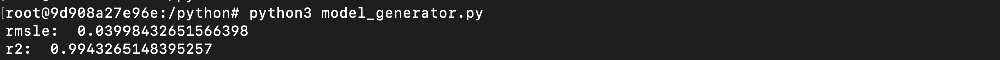
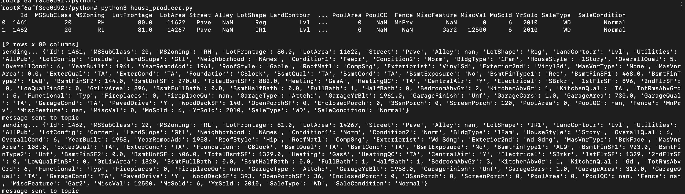
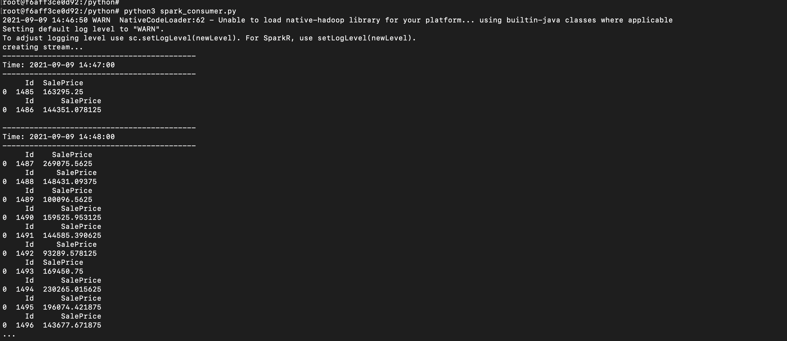
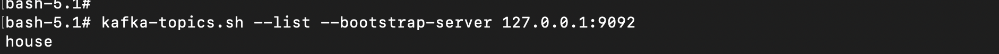
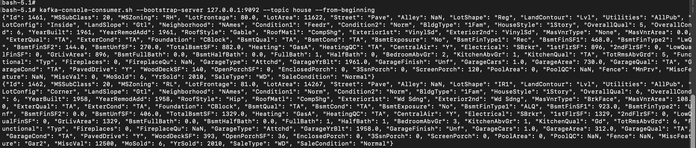

# Steps to run

## Terminal-1 (Build and start container)

Step-1> docker-compose up

## Terminal-2 (Train model, Start Producer)

Step-2> docker exec -it bigdata-cluster-mpp bash

Step-3> cd python

Step-4> python3 model_generator.py

Step-5> python3 house_producer.py

## Terminal-3 (Consumer with Predictor)

Step-6> docker exec -it bigdata-cluster-mpp bash

Step-7> cd python

Step-8> python3 spark_consumer.py

# Kafka commands:

- To start zookeeper service

  nohup bin/zookeeper-server-start.sh config/zookeeper.properties &

- To start kafka server

  nohup bin/kafka-server-start.sh config/server.properties &

- To create topic manually

  kafka-topics.sh --create --topic house --bootstrap-server 127.0.0.1:9092 --partitions 1 --replication-factor 1

- To list all topics

  kafka-topics.sh --list --bootstrap-server 127.0.0.1:9092

- To view topic contents

  kafka-console-consumer.sh --bootstrap-server 127.0.0.1:9092 --topic house --from-beginning

## Model training - Notebook

Trained and compared three models Random forest Regression, XGboost Regression, Linear Regression

Notebook Name: DataAnalysisAndModelCreation.ipynb
 
